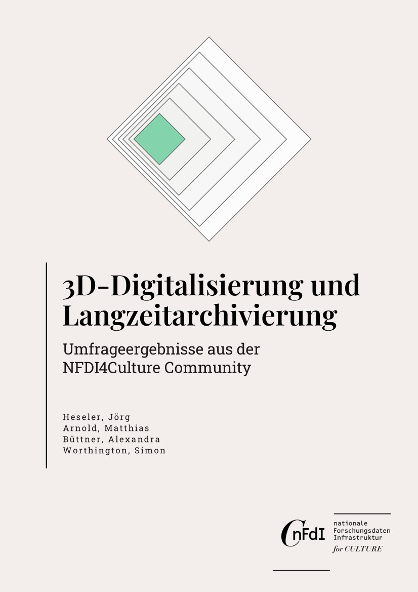

## 3D-Digitalisierung und Langzeitarchivierung – Umfrageergebnisse aus der NFDI4Culture Community

von Jörg Heseler , Matthias Arnold , Alexandra Büttner , und Simon Worthington 

v1.0

 > Deutsche Version: [3D-Digitalisierung und Langzeitarchivierung – Umfrageergebnisse aus der NFDI4Culture Community](https://nfdi4culture.github.io/3d-digitalisierung-und-langzeitarchivierung/)
 > Englische Version: [3D Digitisation and Preservation – Survey Results from the NFDI4Culture Community](https://nfdi4culture.github.io/3d-digitisation-and-preservation/)

<picture>
 <source media="(prefers-color-scheme: dark)" srcset="cover/cover-small.jpg">
 <source media="(prefers-color-scheme: light)" srcset="cover/cover-small.jpg">
 
</picture>

Eines der Projektziele von NFDI4Culture und speziell der [Task Area Data Publication and Availability (TA4)](https://nfdi4culture.de/what-we-do/task-areas/task-area-4.html) ist die Entwicklung von Konzepten für zentrale Langzeitarchivierungsdienste zur Sicherstellung einer nachhaltigen Infrastruktur. Dabei stehen insbesondere Publikationen aus kulturellen Disziplinen mit 3D-Daten im Vordergrund. Die Entwicklung solcher Konzepte setzt die Kenntnis der Bedürfnisse der Produzierenden, Anbietenden und Verwaltenden von Forschungsdaten voraus. Zur Bedarfsermittlung wurde eine Umfrage zur Erstellung, Nutzung und Handhabung von 3D-Modellen durchgeführt, deren Ergebnisse im Folgenden diskutiert werden.
### Zitiert als

Heseler, Jörg; Arnold, Matthias; Büttner, Alexandra; und Worthington, Simon. 2023. 'Erstellung, Nutzung und Handhabung von 3D-Modellen – Umfrageergebnisse aus der NFDI4Culture Community'. Arbeitsgruppe Digitale Publikationen und Daten (NFDI4Culture). [https://doi.org/10.5281/zenodo.8033536](https://doi.org/10.5281/zenodo.8033536). 

© Die Autor:innen.

 Dieses Werk ist lizenziert unter einer <a rel="license" href="https://creativecommons.org/licenses/by/4.0/">Creative Commons Namensnennung 4.0 International Lizenz</a>.
